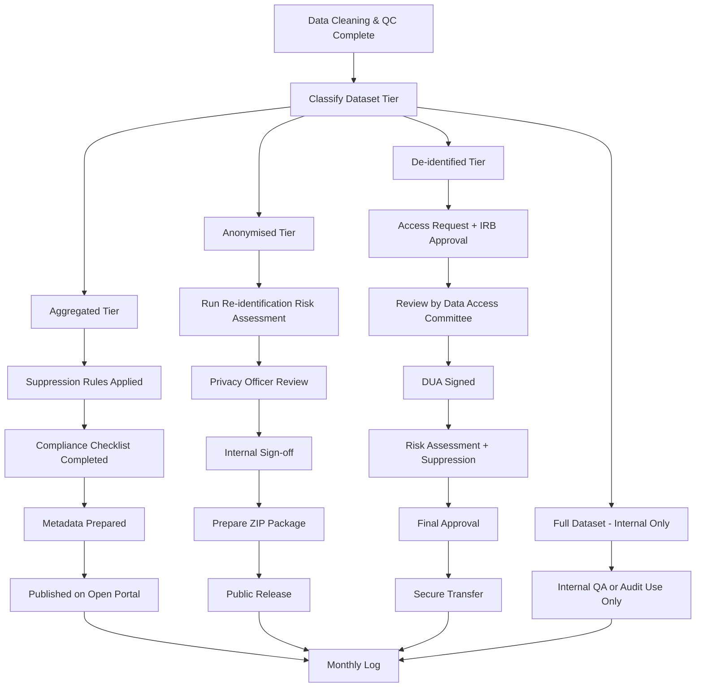

# BNR Dataset Dissemination SOP

**Document Type:** Standard Operating Procedure (SOP)  
**Document Version:** v1.0  
**Effective Date:** [Insert Date]  
**Author:** BNR Data Governance Committee  
**Approved by:** BNR Professional Advisory Board  

---

## 1. Purpose

This SOP outlines the policies and procedures governing dissemination of datasets produced by the BNR. It defines the types of datasets eligible for dissemination, the required approvals and safeguards, and how these align with national legislation including the Barbados Data Protection Act (2019). It also establishes principles for public access, academic use, and internal control.

---

## 2. Scope

This SOP applies to all stakeholders involved in the sharing, access, and reuse of BNR data. It applies to all data types derived from CVD registry operations including acute myocardial infarction and stroke datasets.

---

## 3. Definitions

**Full Dataset:** Complete case-level data with identifying fields (names, national IDs, exact dates, contact info).  

**De-identified Dataset:** Individual-level data with direct identifiers removed and some quasi-identifiers retained (e.g. age, month, parish).  

**Anonymised Dataset:** Data irreversibly stripped of identifiers and generalized (e.g. no dates, age binned).  

**Aggregated Dataset:** Group-level summaries only. No individual data; all counts ≥ 5.

**DUA (Data Use Agreement):** Legal agreement for use of de-identified data.

---

## 4. Responsibilities

| Role                  | Responsibility                                          |
|-----------------------|----------------------------------------------------------|
| Data Abstractor       | Accurate and complete case entry                        |
| Statistician          | Risk analysis, documentation, and tier classification   |
| QC Coordinator        | De-identification QA and suppression validation         |
| Data Privacy Officer  | Disclosure risk sign-off and compliance with law        |
| Technical Lead        | Final approval for dataset release                      |
| Data Access Manager   | Manage access requests and maintain audit logs          |

---

## 5. Risk Assessment for Disclosure

### 5.1 Re-identification Risk Assessment

All datasets except aggregated undergo disclosure risk analysis **each month prior to release**. Risk assessment includes:
- **k-anonymity** and **l-diversity** checks on sensitive variable combinations.
- Frequency tables on combinations like:
  - Age × Sex × Geography
  - Age × Outcome × Date
  - Event type × Length of stay
- Small cell suppression for n < 5.
- Scoring of risk using a 3-level matrix:
  - Low: Approved
  - Medium: Suppression/aggregation required
  - High: Not released

**Monthly Log:** Risk assessment results logged per release (BNR_DISCLOSURE_LOG_<YYYYMM>.txt) and signed by Data Privacy Officer.

### 5.2 Residual Risk Controls

Even after de-identification or anonymisation, residual disclosure risks exist. Mitigation includes:
- Secondary suppression where back-calculation is possible.
- No release of cross-tabulated data for rare combinations.
- Use of binned/rounded variables where needed.
- Data Privacy Officer must review each release and complete a signed residual risk clearance form.

---

## 6. Dataset Types and Access Conditions

| Dataset Tier  | Description                                                    | Access             | Approval                  |
|---------------|----------------------------------------------------------------|--------------------|---------------------------|
| Aggregated    | Counts, percentages, and rates. No individual records.         | Open (website)     | None                      |
| Anonymised    | Fully stripped of identifiers. Cannot be re-identified.        | Public download    | BNR internal sign-off     |
| De-identified | Quasi-identifiers retained. IRB + DUA + Output review needed.  | Restricted         | IRB + Technical Lead      |
| Full          | Identifiable health data. Internal QA/audits only.             | Internal only      | Technical Lead only       |

---

## Data Dissemination Flowchart

---

## 7. Legal Compliance with the Barbados Data Protection Act

BNR dissemination practices align with the **Barbados Data Protection Act (2019)**. Specifically:

- **Fair and lawful processing:** All releases follow documented procedures and are justified by public interest in health, under the research/statistics exemption.

- **Purpose limitation:** Data is disseminated solely for public health monitoring, approved research, or public transparency.

- **Data minimisation:** Datasets released externally (anonymised or aggregated) contain only essential, non-identifying variables.

- **Storage limitation (Retention):**  
  BNR does **not delete** core datasets. This is justified under the Act’s **Research and Statistics exemption**, which permits longer retention provided:
  - Data is not used to take decisions about individuals.
  - Technical and organisational safeguards are in place.
  - Data is not disclosed in an identifiable form.

- **Security and integrity:** All dissemination follows internal approval procedures, encrypted transfers (where needed), and includes metadata documentation.

---

## 8. Review and Publication

- An **internal checklist** is used for every dissemination to validate:
  - Tier classification
  - Suppression rules applied
  - Risk clearance
  - Metadata completeness

- Disseminated datasets include:
  - Data file (CSV, DTA, or JSON)
  - Metadata (`.txt`)
  - Suppression note
  - Recommended citation (for public use)

---

## 9. Version Control and Audit

- Each dissemination assigned a unique name: `BNR-<CVD>-<TIER>-<YYYYMM>.dta`
- Audit logs stored in `BNR-ACCESS-LOG-<YYYYMM>.txt`
- Monthly sign-off required from Technical Lead and Data Privacy Officer

---

## 10. Contact and Queries

For dataset access requests or questions, contact:  
**Data Access Manager**  
📧 datarequests@bnr.org.bb  

---

## 11. Review Cycle

- SOP reviewed every 12 months or sooner if legislation or BNR policy changes.
- Revisions must be approved by the BNR Professional Advisory Board.
  