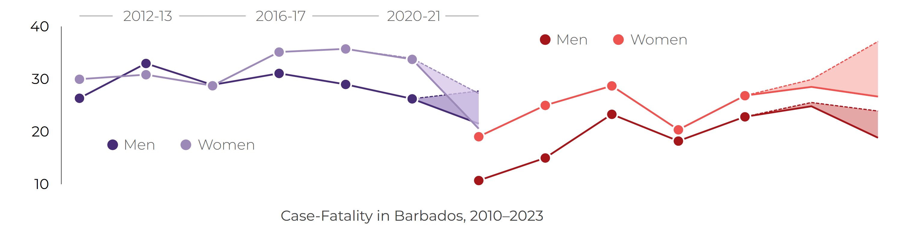

# In-Hospital Cardiovascular Deaths in Barbados

Briefing created by the Barbados National Chronic Disease Registry, The University of the West Indies. Group Contacts ◉ Christina Howitt (BNR lead)  ◉  Ian Hambleton (analytics). Updated on: 18 Nov 2025 at 09:05:00 

For all our surveillance outputs: https://uwi-bnr.github.io/resource-hub/5Downloads/
 

---

[Download Briefing](../../downloads/briefings/bnr-cvd-case-fatality-2023.pdf){ .md-button .btn-center target="_blank"}

## Why This Matters
Case fatality shows the proportion of patients admitted with a heart attack or stroke who die before leaving hospital. It is one of the clearest indicators of healthcare performance, reflecting how quickly patients reach care and how effectively that care is delivered. Falling rates suggest improvements in detection, treatment, or recovery support, while rising rates may point to delayed presentation, older or more complex patients, or hospital strain. Tracking these trends helps reveal whether hospital outcomes are improving over time.

## What We Did
We analysed hospital admissions for stroke and heart attack in Barbados from 2010 to 2023. For each two-year period, we calculated the proportion of patients who died before discharge — the in-hospital case-fatality rate — by sex. To account for incomplete follow-up in recent years, we showed both confirmed hospital deaths (solid lines) and confirmed + probable deaths (dotted lines), where “probable” refers to patients who died within seven days of their event but whose discharge date has not yet been verified. The figure shows these actual rates; we used separate modelling to estimate uncertainty and adjust for age.

## Case Fatality is Higher in Women for Heart Attacks  and Strokes

{ align=left }

spacer

[:fontawesome-solid-file-excel:  Excel Download](../../downloads/data/bnrcvd-case-fatality-figure1.xlsx){ .md-button-data .btn-center target="_blank"}
[:fontawesome-solid-table:Stata Download](../../downloads/data/bnrcvd-case-fatality-figure1.dta){ .md-button-data .btn-center target="_blank"}

Between 2010 and 2023, in-hospital deaths after stroke changed little, while heart attack deaths fluctuated but trended upward. In both conditions, women consistently had higher case-fatality than men. In 2023, 27% of men and 34% of women admitted with cardiovascular disease died before discharge. After adjusting for age, the female rate fell to 30%, showing that age explains about half of this gap. Women admitted with heart attack or stroke were, on average, seven years older than men, and those who died in hospital were similarly older. Seven in ten women, compared with just over half of men, were aged 70 years or older at the time of their event. Even so, women remained more likely to die in hospital than men.

{ align=left }

## What This Means
Case-fatality rates show how outcomes differ once patients reach hospital care. The persistence of higher rates among women—only partly explained by age—highlights the need to understand potential differences in presentation, treatment, or recovery that may affect survival.

 
