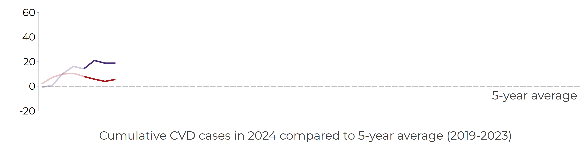
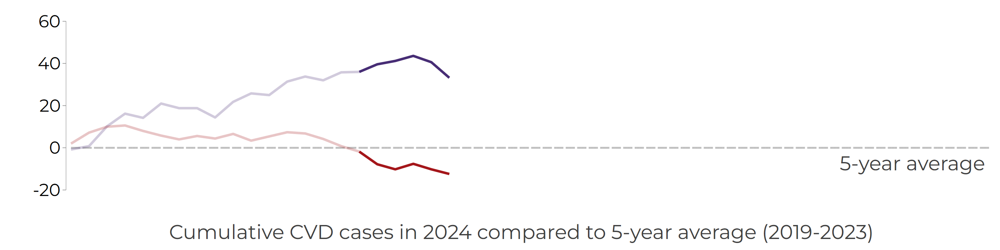
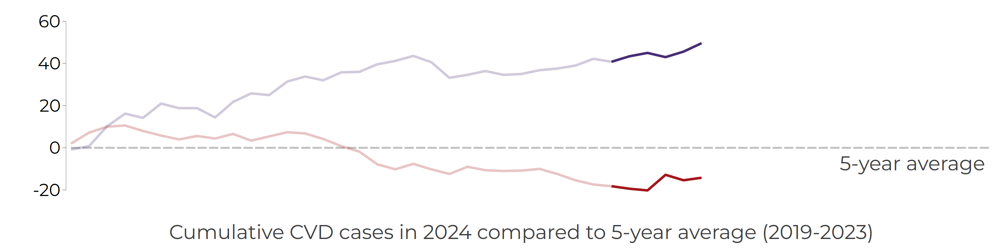
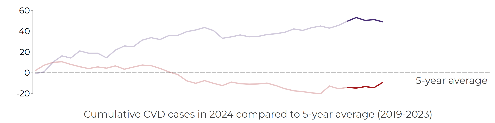

# How To: Monitor CVD Events 

In your BNR-analytics DO file repository there are four files with the prefix **bnrcvd-2024**.

| Do file | Description | 
| -- | -- | 
[**bnrcvd-2024-redcap-format.do**](https://github.com/UWI-BNR/bnr-analytics/blob/main/do/bnrcvd-2024-redcap-format.do){ target="_blank"} | Exports data from REDCap into Stata format |
|[**bnrcvd-2024-redcap-noformat.do**](https://github.com/UWI-BNR/bnr-analytics/blob/main/do/bnrcvd-2024-redcap-noformat.do){ target="_blank"} | Exports data from REDCap into a CSV file, with all variables exported as strings. This is a simpler export version, should the Stata-formatting in the formatted export fail for any reason |
|[**bnrcvd-2024-prep1.do**](https://github.com/UWI-BNR/bnr-analytics/blob/main/do/bnrcvd-2024-prep1.do){ target="_blank"} | Prepares the 2024 data exports for subsequent analytics|
|[**bnrcvd-2024-count.do**](https://github.com/UWI-BNR/bnr-analytics/blob/main/do/bnrcvd-2024-count.do){ target="_blank"} | Creates weekly cumulative "worm" plots of new CVD events|

These are example files, providing one possible process for exporting monthly 2024 (and beyond) data from REDCap, with minimal changes to the 2023 code, and creating simple monthly plots for event monitoring in "real time" (could do this daily, for example if this ever made sense).

The entire process could be wrapped in further automation, but at this stage - with process change still to be decided on and enacted - automation would be premature.

Nevertheless, the final do file (`bnrcvd-2024-worms.do`) creates the following monthly plots of new CVD events in 2024, which can be used to monitor trends as the year progresses.

## New CVD Events in 2024 by Month

=== "Jan"

    { align=left }

=== "Feb"

    { align=left }

=== "Mar"

    { align=left }

=== "Apr"

    { align=left }

=== "May"

    { align=left }

=== "Jun"

    { align=left }

=== "Jul"

    { align=left }

=== "Aug"

    { align=left }

=== "Sep"

    { align=left }

=== "Oct"

    { align=left }

=== "Nov"

    { align=left }

=== "Dec"

    { align=left }

 
